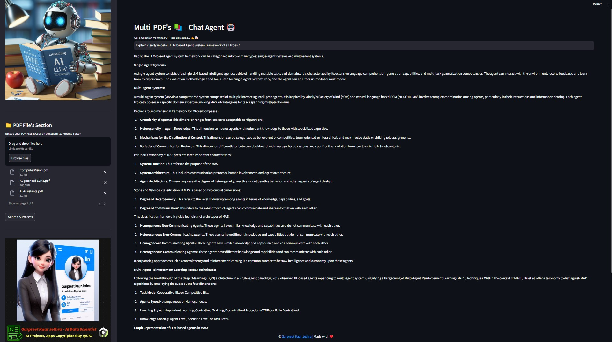
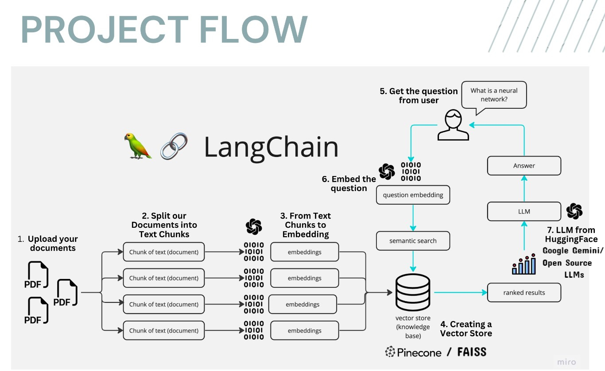
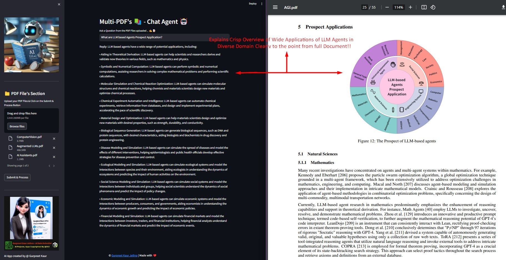
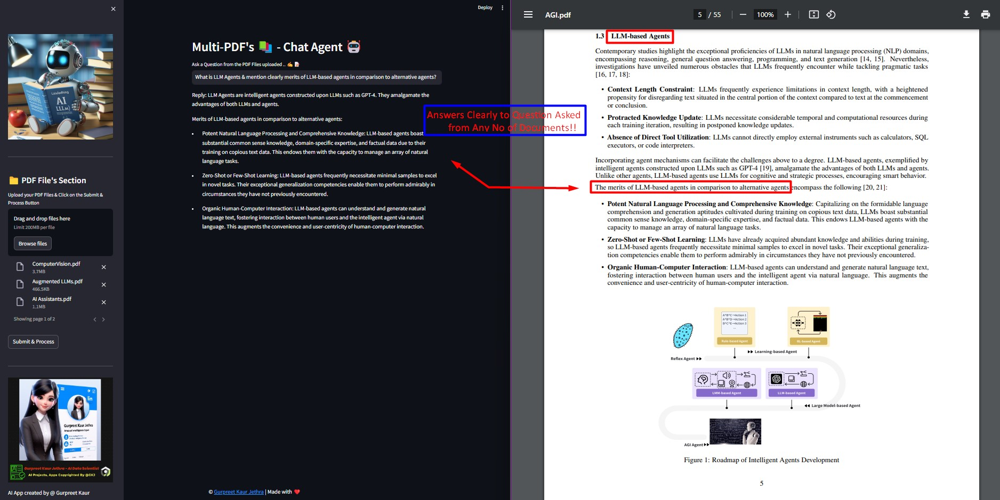
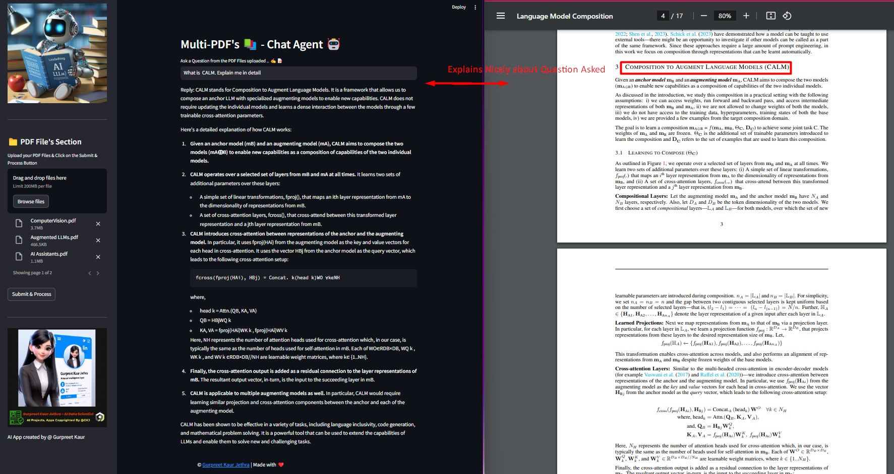

# Multi-PDF-s 📚ChatApp AI Agent 🤖

Meet MultiPDF Chat AI App! 🚀 Chat seamlessly with Multiple PDFs using Langchain, Google Gemini Pro &amp; FAISS Vector DB with Seamless Streamlit Deployment. Get instant, Accurate responses from Awesome Google Gemini OpenSource language Model. 📚💬 Transform your PDF experience now! 🔥✨

## 📝 Description
The Multi-PDF's Chat Agent is a Streamlit-based web application designed to facilitate interactive conversations with a chatbot. The app allows users to upload multiple PDF documents, extract text information from them, and train a chatbot using this extracted content. Users can then engage in real-time conversations with the chatbot.

## 📢Demo App with Streamlit Cloud (Visualize only)

[Launch App On Streamlit](https://multi-pdfschatappai-agent.streamlit.app/)

## 💻 Demo:


## 🎯 How It Works:
------------



The application follows these steps to provide responses to your questions:

1. **PDF Loading** : The app reads multiple PDF documents and extracts their text content.

2. **Text Chunking** : The extracted text is divided into smaller chunks that can be processed effectively.

3. **Language Model** : The application utilizes a language model to generate vector representations (embeddings) of the text chunks.

4. **Similarity Matching** : When you ask a question, the app compares it with the text chunks and identifies the most semantically similar ones.

5. **Response Generation** : The selected chunks are passed to the language model, which generates a response based on the relevant content of the PDFs.



--- 
## 🎯 Key Features

- **Adaptive Chunking**: Our Sliding Window Chunking technique dynamically adjusts window size and position for RAG, balancing fine-grained and coarse-grained data access based on data complexity and context.

- **Multi-Document Conversational QA**: Supports simple and multi-hop queries across multiple documents simultaneously, breaking the single-document limitation.

- **File Compatibility**: Supports both PDF and TXT file formats.

- **LLM Model Compatibility**: Supports Google Gemini Pro, OpenAI GPT 3, Anthropic Claude, Llama2 and other open-source LLMs.





## 🌟Requirements

- **Streamlit** : A Python library for building web applications with interactive elements.
- **google-generativeai** : It is a package that provides generative AI capabilities for chatbots and virtual agents. It can be used in a variety of applications such as content generation, dialogue agents, summarization and classification systems and more.
- **python-dotenv** : A library for loading environment variables from a `.env` file. This is commonly used to store configuration settings, API keys, and other sensitive information outside of your code.
- **langchain** : A custom library for natural language processing tasks, including conversational retrieval, text splitting, embeddings, vector stores, chat models, and memory.
- **PyPDF2** : PyPDF2 is a library for reading and manipulating PDF files in Python. It can be used to merge, split, and modify PDFs. In the context of a multipdf chatbot, PyPDF2 could be used to handle the manipulation and generation of PDF files based on user input or responses.
- **faiss-cpu** : FAISS (Facebook AI Similarity Search) is a library developed by Facebook for efficient similarity search, Machine Learning Embeddings,Information Retrieval, content-based filtering and clustering of dense vectors.
- **langchain_google_genai** : It is a package that provides an integration between LangChain and Google’s generative-ai SDK. It contains classes that extend the Embeddings class and provide methods for generating embeddings. The package can be used in a multipdf chatbot application to extract textual data from PDF documents and generate Accurate responses to user queries.


---

## ▶️Installation

Clone the repository:

`git clone https://github.com/GURPREETKAURJETHRA/Multi-PDFs_ChatApp_AI-Agent.git`

Install the required Python packages:

`pip install -r requirements.txt`

Set up your Google API key from `https://makersuite.google.com/app/apikey` by creating a .env file in the root directory of the project with the following contents:

`GOOGLE_API_KEY =<your-api-key-here>`

Run the Streamlit app:

`streamlit run app.py`

---
## 💡Usage

To use the Multi-PDF-s 📚ChatApp AI Agent 🤖, U can have glimpse of look by clicking on this link : [Launch App On Streamlit](https://multi-pdfschatappai-agent.streamlit.app/). To run app, fork app and follow the below steps to start using it. Use the sidebar to upload PDF files and train the chatbot. Once trained, you can have conversations with the chatbot by entering questions in the text input field.

In case You want to run & implement project on your system then follow these steps:

1. Ensure that you have installed the required dependencies and added the **Google API key to the `.env` file** (MUST).
2. Run the `app.py` file using the Streamlit CLI. Execute the following command:
   ```
   streamlit run app.py
   ```
3. The application will launch in your default web browser, displaying the user interface.
4. Upload multiple PDF documents into the app by following the provided instructions at sidebar. On the sidebar, you'll find an option to upload PDF documents. Click on the "Upload your documents here and click on Process" button and select one or more PDF files. 
5. Don't forget to click on Submit & Process Button.
6. Ask questions in natural language about the loaded PDFs using the chat interface.
7. Chatting with the Documents: After uploading and processing the PDF documents, you can ask questions by typing them in the text input field. Press Enter or click the "Ask" button to submit your question.

The application will use conversational AI to provide responses based on the content of the uploaded documents. The responses will be displayed in the chat interface.

---
## ©️ License 🪪 

Distributed under the MIT License. See `LICENSE` for more information.

---

#### **If you like this LLM Project do drop ⭐ to this repo**
#### Follow me on [](https://www.linkedin.com/in/gurpreetkaurjethra/) &nbsp; [](https://github.com/GURPREETKAURJETHRA/)

---
